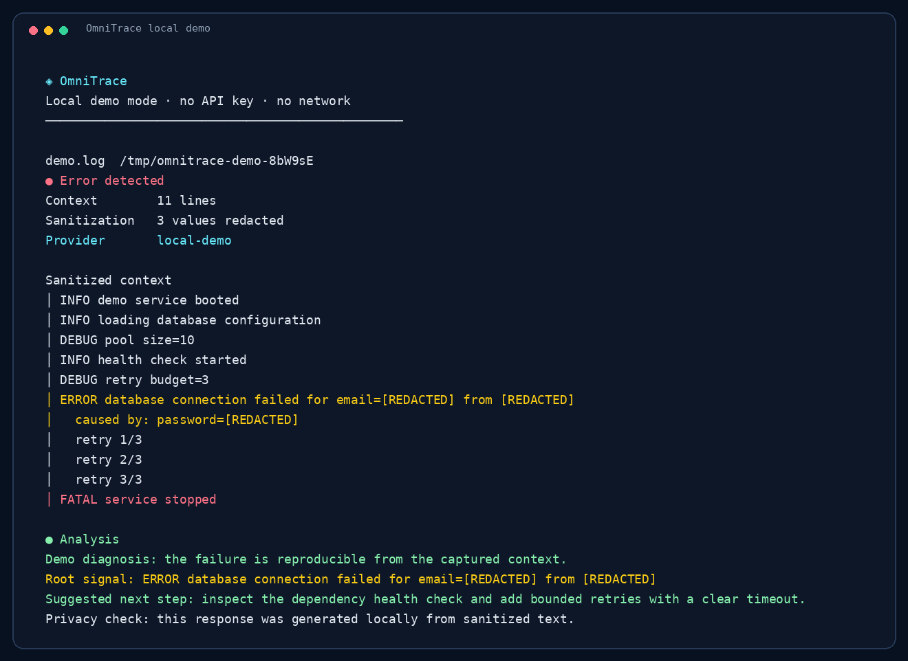
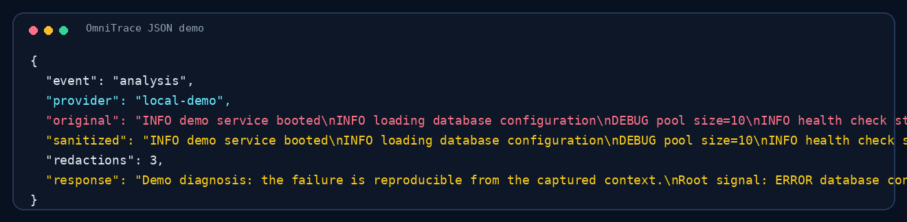

# OmniTrace

OmniTrace is an open-source, privacy-first AI log debugger for developers. It watches application logs in real time, captures the context around failures, redacts sensitive values locally, and routes the sanitized context to OpenAI or a local Ollama model.

Project website: **[getomnitrace.bond](https://getomnitrace.bond)**. The public website is intentionally deferred; this repository is focused on the CLI engine, demo workflow, and developer tooling. The current `assets/` directory contains product branding only, not the future marketing site.

## Why OmniTrace

OmniTrace is designed for fast incident response without casually leaking production data. It combines real-time log tailing, deterministic local redaction, and provider choice in one small command-line workflow. Cloud analysis is available when convenient, while Ollama provides a local path for teams that need logs to remain on their own machine.

## Requirements

Node.js 18.17 or newer is required. If `node -v` shows v12, upgrade before installing; OmniTrace now exits early with a readable version message instead of a cryptic `Cannot find module 'node:path'` error. On a Linux shell, the simplest upgrade path is:

```bash
curl -o- https://raw.githubusercontent.com/nvm-sh/nvm/v0.39.8/install.sh | bash
. ~/.nvm/nvm.sh
nvm install 20
nvm use 20
node -v
```

For local analysis, install [Ollama](https://ollama.com/) and pull a model such as `llama3.2`.

## Install

Install OmniTrace globally from npm—no repository clone is needed:

```bash
npm install -g omnitrace
omnitrace
```

Running `omnitrace` without arguments opens a beginner-friendly local onboarding screen. For the complete no-key walkthrough, run:

```bash
omnitrace demo
```

To watch an application log, run:

```bash
omnitrace analyze ./app.log
```

To update later:

```bash
npm update -g omnitrace
```

### Development-only installation

Repository cloning and tarballs are only needed if you are contributing to OmniTrace or testing unreleased source:

```bash
git clone https://github.com/adityv/omnitrace.git
cd omnitrace
npm install -g .
omnitrace demo
```

To make a local tarball while developing:

```bash
npm pack
npm install -g ./omnitrace-<version>.tgz
omnitrace demo
```


## Brand and demo preview


The screenshots below are generated from the real CLI output, not a mockup.





## Try it immediately without an API key

After installation, run this safe local demo:

```bash
omnitrace demo
```

The demo creates a temporary log, watches it with the real file watcher, detects a synthetic failure, redacts an email, IP address, and password, then prints a local diagnosis. It uses no API key, no external account, no Ollama installation, and no network request. For scripts or CI, use JSON output:

```bash
omnitrace demo --json
```

## Guided setup

For an interactive first-time setup, run:

```bash
omnitrace setup
```

For scripts or a local-only default without prompts:

```bash
omnitrace setup --yes --provider ollama --model llama3.2
```

You can rerun setup or use `omnitrace config set ...` at any time. Configuration remains on your machine in `~/.omnitrace-config.json`; the CLI does not upload configuration files or logs by itself.

## Configure

OmniTrace stores configuration in `~/.omnitrace-config.json` using a platform-safe path and restrictive file permissions. It can also read the PRD-compatible `~/.omnitrace/config.json` location for backwards compatibility.

For local analysis:

```bash
omnitrace config set provider ollama
omnitrace config set model llama3.2
```

For OpenAI:

```bash
omnitrace config set provider openai
omnitrace config set apiKey YOUR_OPENAI_API_KEY
omnitrace config set model gpt-4o-mini
```

The router also accepts `OPENAI_API_KEY` from the environment. Endpoint overrides are available for compatible gateways and local deployments:

```bash
omnitrace config set openaiUrl https://api.openai.com/v1/chat/completions
omnitrace config set ollamaUrl http://localhost:11434/api/generate
```

## Inspect active configuration

```bash
omnitrace config show
```

Credentials are masked in the output. Configuration writes to `~/.omnitrace-config.json` and accepts the legacy `~/.omnitrace/config.json` location for reading.

## Analyze a log

```bash
omnitrace analyze ./app.log
```

The command stays attached and continues watching for new errors. Use `Ctrl+C` to stop it. For machine-readable integrations, add `--json`:

```bash
omnitrace analyze ./app.log --json
```

Add an extra instruction for the model when needed:

```bash
omnitrace analyze ./app.log --prompt "Focus on database connection pooling."
```

When an `ERROR`, `FATAL`, `Exception`, or `Traceback` line is detected, OmniTrace captures up to five lines before and after the event. The captured block is sanitized before it is sent to an AI provider.

## Privacy and sanitization

The built-in scrubber redacts email addresses, IPv4 and IPv6 addresses, AWS access keys, JWTs, common Stripe-style keys, credit-card-like numbers, bearer authorization values, and values assigned to keys such as `api_key`, `token`, `password`, `secret`, and `authorization`.

No sanitizer can guarantee detection of every proprietary secret format. Review your organization's data-handling requirements before sending logs to a third-party provider. Use Ollama when logs must remain on the local machine, and always inspect the sanitized output policy before adopting OmniTrace in production.

## Development and quality gates

```bash
npm install
npm run lint
npm test
npm run coverage
npm run security
npm run package-check
```

The project uses Node's built-in test runner, ESLint, c8 coverage thresholds, npm audit, and GitHub Actions. CI runs on Linux, macOS, and Windows across Node.js 18, 20, and 22. The test suite does not require a live AI provider.

## Project layout

```text
bin/cli.js       Commander entry point
src/config.js   User configuration persistence
src/sanitizer.js Local redaction rules
src/watcher.js  Cross-platform file tailing and context capture
src/ai.js       OpenAI and Ollama routing
src/demo.js     Zero-key local demonstration flow
src/setup.js    Guided local provider setup wizard
src/ui.js       Terminal presentation and JSON formatting
assets/         Logo and repository branding
test/           Unit, integration, demo, and CLI smoke tests
.github/        Cross-platform CI and contribution templates
```

## Contributing

Use the issue template for reproducible reports and include sanitized logs only. Before opening a pull request, run the complete quality-gate commands above and review changes for accidental credentials or personal data.

## License and ownership

OmniTrace is released under the MIT License. Maintained by [Aditya Wadhonkar](https://github.com/adityv).
